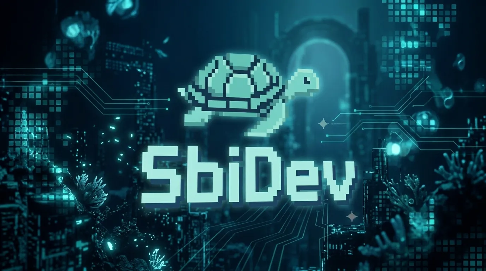

_Hola, soy Sebastian Briceño también conocido como SbiDev_

**📜 Técnico Superior en Informática - 📚 Aprendiz FullStack**   **⚙️ Apasionado por la Arquitectura de Software, el Diseño y el Código Bien Estructurado ✒️**

~Amante del Café y el Arte ☕   🇻🇪

---

### 🔗 Proyectos en los que Trabajo

| Proyecto | Descripción | |
| --- | --- | --- |
| **📊 [NominaSystem](https://github.com/SbiDev-447/NominaSystem)** | Sistema de Gestión de Nómina. SPA con Node.js, Express y JS vanilla. |  |
| **🎨 [TurtleGlassesTheme](https://github.com/SbiDev-447/TurtleGlassesVSCode)** | Tema Personalizado para VSCode |  |
| **🐚 [Dotfiles-SbiDev](https://github.com/SbiDev-447/Dotfiles-SbiDev)** | Mis dotfiles personales (Neovim, Tmux y más) |  |
---

### 🛠️ Tech Stack

| Área | Tecnologías |
|------|-------------|
| **Frontend** |     |
| **Backend** |   |
| **Base de Datos** |  |
| **Editor y Terminal** |     |
| **Herramientas** |   |

  

 

 

